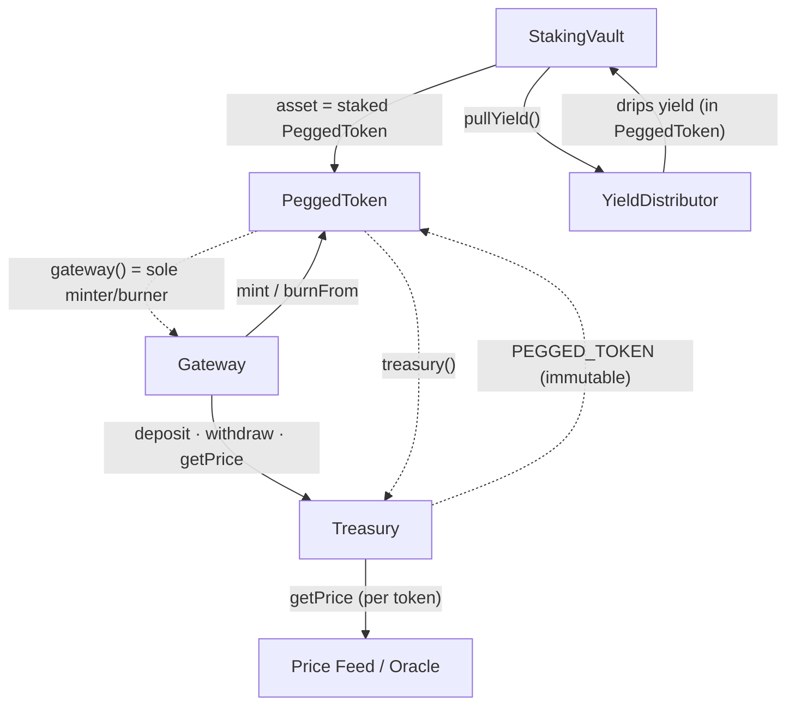

# VETRO — Domain Guide

What the protocol is, and how each page in `web/` works. Developer-facing and practical; describes what's shipped today, not the roadmap. For quick term lookups see [`glossary.md`](./glossary.md).

## The protocol in one page

VETRO lets users mint a **pegged token** — a token fully backed by reserves and held at a peg — and optionally put it to work for yield. The protocol is built from a few **roles** that repeat per asset; specific symbols (`VUSD`, `sVUSD`, `vetBTC`, …) are configured instances. Treat the role as primary and the symbol as configuration:

- **Pegged token** (e.g. `VUSD`, `vetBTC`) — the base 1:1 settlement token. You mint it by depositing a **whitelisted token** (approved collateral — stablecoins for a USD gateway, BTC-class assets for a BTC gateway) through that token's **Gateway**, minus a small fee. Over-collateralized; holds no yield on its own. Generic `peggedToken` in code.
- **Share token** (e.g. `sVUSD`, `svetBTC`) — an ERC-4626 vault share you get by **staking** a pegged token on Earn. Yield from treasury strategies accrues into the vault, so each share redeems for more pegged token over time (price-per-share rises). `isVaultShare: true` in code; the generic `shareToken`.
- **Treasury** — a per-pegged-token contract that holds the whitelisted collateral and decides what to do with it (it routes it into yield-bearing strategies). From the app's POV it's where collateral is held and redemptions are paid from; backing (collateral value vs circulating supply) is surfaced on Analytics.
- **Borrow / CDP** — instead of minting from collateral, users can deposit crypto (e.g. hemiBTC, WETH) and **borrow** a pegged token against it via Morpho Blue, without selling the crypto.
- **Omnichain** — VETRO tokens are LayerZero **OFTs**, so the same token exists natively across chains (Ethereum, Hemi, Arbitrum, Base, BSC, Optimism), moved with the Bridge page without wrapping.

> **Don't hardcode symbols.** The active instances are read **on-chain**, not from a static list — `tokenList.ts` is only an ERC-20 metadata cache for display. Write against the role (`peggedToken`, `shareToken`, `whitelistedToken`) and read instances from their gateway/vault; `VUSD` is just today's most prominent instance, not a special case to branch on. See [Where things live](#where-things-live) for the exact files.

So there are two reasons to hold a pegged token — keep it as a settlement asset (Swap) or stake it for yield (Earn) — plus a path for crypto holders who want liquidity without selling (Borrow).

## How the contracts fit together

The on-chain contracts this app reads, and the calls between them. Each box is one contract.

**Legend:**

- **Solid arrow** — runtime call.
- **Dotted arrow** — stored address / authorization.

**Arrows:**

- **Gateway → PeggedToken** — `mint` on swap-in, `burnFrom` on redeem; the gateway is the only authorized caller.
- **Gateway → Treasury** — moves collateral in/out (`deposit`/`withdraw`) and reads `getPrice` for peg-band checks. Gateway resolves its Treasury via `peggedToken.treasury()`.
- **Treasury → Oracle** — `getPrice` reads the per-token price feed (one of the Chainlink/Derived/Fixed adapters); the app only touches the oracle through the Treasury.
- **StakingVault → PeggedToken** — the vault's ERC-4626 `asset`; staking deposits it, withdrawing returns more as yield accrues.
- **StakingVault ↔ YieldDistributor** — the vault `pullYield()`s the linearly-dripped yield (denominated in the PeggedToken) before share-price-sensitive ops.
- **Dotted (config)** — PeggedToken stores its `gateway`/`treasury`; Treasury holds an immutable `PEGGED_TOKEN`. These addresses authorize the runtime calls above.

## Pages (`web/src/pages`)

### Swap — mint & redeem pegged tokens

"Swap your tokens with Vetro assets." The form is generic over gateways: it lists every configured gateway's pegged token (read on-chain via `getPeggedToken`) and that gateway's whitelisted collateral (read from the gateway's Treasury via `getWhitelistedTokens`). The user picks a pegged token and one of its whitelisted tokens. Two directions:

- **Mint (swap in):** deposit a whitelisted token (e.g. USDC/USDT for the VUSD gateway) → receive that gateway's pegged token ~1:1, minus the on-chain **mint fee**. Single transaction.
- **Redeem (swap out):** return a pegged token → receive a whitelisted token. Which path the form shows is computed by `fetchRedeemDelay` from **two** conditions: whether the gateway has its **withdrawal delay enabled** (`getWithdrawalDelayEnabled`) and whether the connected **address is whitelisted** for instant redeem (`isInstantRedeemWhitelisted`). When the delay is enabled _and_ the address is not whitelisted — the common case for most users — the form renders the **two-step Redeem Queue** (`twoStepRedeem`): _Send to Queue_ → a short **security cooldown** (seconds, anti-flashloan/MEV) → _Redeem_ to the whitelisted token of choice; a queued redeem can be cancelled. Otherwise (delay disabled, or the address is whitelisted) the form renders **one-step redeem** (`oneStepRedeem`) — instant, single transaction. Entry point: `web/src/components/swapForm/redeem.tsx`, which dispatches to `twoStepRedeem.tsx` or `oneStepRedeem.tsx`.

**Peg band.** Mint and redeem aren't always 1:1. The Gateway prices each whitelisted token against its Treasury oracle: while the token stays within a small **peg band** around its peg, the rate is a flat 1:1 (after fees); once the price moves outside the band, the rate follows the oracle instead. The Swap quote already reflects this.

Edge cases: a redemption pays from the Treasury's idle balance first, then withdraws the rest from the vault. Which whitelisted tokens are redeemable depends on what the Treasury currently holds.

### Earn — stake a pegged token for yield

"Stake assets to earn variable yield." Deposit a pegged token into its staking vault → receive the corresponding share token. Yield accrues as price-per-share appreciation; the headline number is the **APY**. There is one pool per pegged token; the active set is `stakingVaultAddresses` (`packages/earn`), which the page maps over — don't assume a single hardcoded pool.

Withdrawing has two paths:

- **Instant withdraw:** addresses on the vault's instant-withdraw whitelist only (`getInstantWithdrawWhitelist`).
- **Request withdrawal → cooldown → exit ticket:** the standard path. Requesting moves funds into a **cooldown** (multi-day, read on-chain via `getCooldownDuration`), during which they are locked and **earn no yield**. Each request becomes an **exit ticket** (cooldown → ready → withdrawn, or cancelled if deleted). A ticket can be **deleted** to cancel and put funds back to staked-and-earning. "Withdraw all" claims every ready ticket.

Why the cooldown: it prevents reward sniping and gives the treasury a predictable liquidity horizon. Exit tickets render in their own table, gated by `useShowExitTickets`.

### Borrow — CDP against crypto

"Supply tokens to borrow {pegged token}." A UI over pre-existing **Morpho Blue** markets (`marketIds`) that works as a regular CDP: supply crypto collateral (e.g. hemiBTC/WETH) → borrow the market's loan token (a pegged token) against it, without selling the collateral. The borrow token and parameters come from the Morpho market itself — Borrow doesn't use the Gateway/Earn/Treasury machinery the other pages rely on. The UI guards against opening a second position for an address that already has one, and lets you manage an open position (borrow more, supply more collateral, repay, withdraw collateral).

Key terms: **health factor** (above 1.0 safe; at/below 1.0 liquidatable), **LTV** (debt ÷ collateral value), **liquidation price**, and **effective interest** (base APR minus any rebates). On liquidation, collateral is sold to repay the debt plus a penalty to liquidators — the UI warns first.

### Bridge — move tokens across chains

"Bridge assets across chains." Send a bridgeable VETRO token from one chain to another via LayerZero OFT. The bridgeable set is configured in `web/src/utils/bridgeableTokens.ts` — not every pegged or share token is necessarily bridge-enabled, so read the set rather than assuming it. Pick a source and destination chain, pay a **LayerZero fee**, then wait for funds to arrive (a few minutes). No wrapping — supply is unified across chains.

### Analytics

"Monitor protocol analytics." A read-only dashboard of protocol health, per pegged token: **TVL**, **collateralization ratio** (backing vs circulating, broken down into strategic reserves / liquid reserves / surplus), **peg stability**, total **staked**, **exit queue** (total on cooldown), and **yield allocation** (number of active strategies, plus the idle reserve buffer not yet deployed to a strategy).

## Where things live

Sources of truth for which instances exist (read these; don't hardcode symbols):

- Gateways → pegged tokens, read on-chain via `getPeggedToken`: `gatewayAddresses` (`packages/gateway`)
- Staking vaults → share tokens: `stakingVaultAddresses` (`packages/earn`)
- Bridge page whitelist (the one static set): `web/src/utils/bridgeableTokens.ts`
- Borrow markets: [`web/src/constants/borrow.ts`](../web/src/constants/borrow.ts) (Morpho Blue, `packages/morpho-blue-market`)

For display only — **not** enablement: `web/src/utils/tokenList.ts` (`knownTokens`) is a hardcoded cache of ERC-20 metadata (symbol, decimals, logo) for fast loading.

And where the UI lives:

- Page roots: under `web/src/pages/` — one file or folder per page (check the folder; e.g. `earn/` and `analytics/` are folders, others are single files)
- Forms/flows: `web/src/components/{swapForm,bridgeForm,borrow}` and `web/src/pages/earn/components`
- Analytics/history data is backed by `api/` and the `subgraph/`
