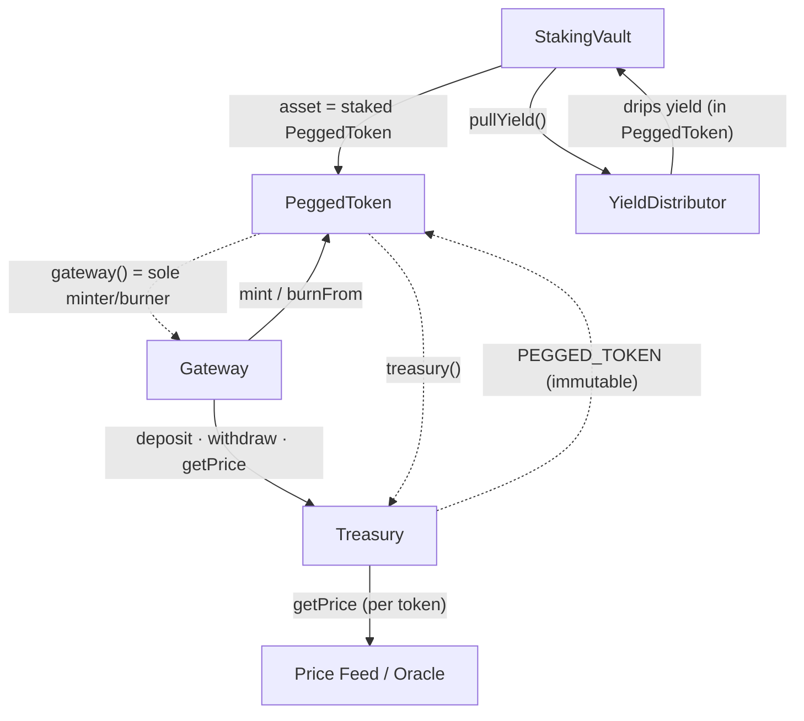

# VETRO — Domain Guide

What the protocol is, and how each page in `web/` works. Developer-facing and practical; describes what's shipped today, not the roadmap. For quick term lookups see [`glossary.md`](./glossary.md).

## The protocol in one page

VETRO lets users mint a **pegged token** — a token fully backed by reserves and held at a peg — and optionally put it to work for yield. The protocol is built from a few **roles** that repeat per asset; specific symbols (`VUSD`, `sVUSD`, `vetBTC`, …) are configured instances. Treat the role as primary and the symbol as configuration:

- **Pegged token** (e.g. `VUSD`, `vetBTC`) — the base 1:1 settlement token. You mint it by depositing a **whitelisted token** (approved collateral — stablecoins for a USD gateway, BTC-class assets for a BTC gateway) through that token's **Gateway**, minus a small fee. Over-collateralized; holds no yield on its own. Generic `peggedToken` in code.
- **Share token** (e.g. `sVUSD`, `svetBTC`) — an ERC-4626 vault share you get by **staking** a pegged token on Earn. Yield from treasury strategies accrues into the vault, so each share redeems for more pegged token over time (price-per-share rises). `isVaultShare: true` in code; the generic `shareToken`.
- **Treasury** — a per-pegged-token contract that holds the whitelisted collateral and decides what to do with it (it routes it into yield-bearing strategies). From the app's POV it's where collateral is held and redemptions are paid from; backing (collateral value vs circulating supply) is surfaced on Analytics.
- **Borrow / CDP** — instead of minting from collateral, users can deposit crypto (e.g. hemiBTC, WETH) and **borrow** a pegged token against it via Morpho Blue, without selling the crypto.
- **Omnichain** — VETRO tokens are LayerZero **OFTs**, so the same token exists natively across chains (Ethereum, Hemi, Arbitrum, Base, BSC, Optimism), moved with the Bridge page without wrapping.

> **Don't hardcode symbols.** The active instances are read **on-chain**, not from a static list — `tokenList.ts` is only an ERC-20 metadata cache for display. Write against the role (`peggedToken`, `shareToken`, `whitelistedToken`) and read instances from their gateway/vault; `VUSD` is just today's most prominent instance, not a special case to branch on. See [Where things live](#where-things-live) for the exact files.

So there are two reasons to hold a pegged token — keep it as a settlement asset (Swap) or stake it for yield (Earn) — plus a path for crypto holders who want liquidity without selling (Borrow).

## How the contracts fit together

The on-chain contracts this app reads, and the calls between them. Each box is one contract.


```mermaid
graph TD
    PT["PeggedToken"]
    GW["Gateway"]
    TR["Treasury"]
    OR["Price Feed / Oracle"]
    SV["StakingVault"]
    YD["YieldDistributor"]

    %% Swap — mint / redeem
    GW -->|"mint / burnFrom"| PT
    GW -->|"deposit · withdraw · getPrice"| TR
    TR -->|"getPrice (per token)"| OR

    %% Earn — stake for yield
    SV -->|"asset = staked PeggedToken"| PT
    SV -->|"pullYield()"| YD
    YD -->|"drips yield (in PeggedToken)"| SV

    %% Config / authorization wiring (who-knows-whom)
    PT -.->|"gateway() = sole minter/burner"| GW
    PT -.->|"treasury()"| TR
    TR -.->|"PEGGED_TOKEN (immutable)"| PT
```

**Legend:**

- **Solid arrow** — runtime call.
- **Dotted arrow** — stored address / authorization.

**Arrows:**

- **Gateway → PeggedToken** — `mint` on swap-in, `burnFrom` on redeem; the gateway is the only authorized caller.
- **Gateway → Treasury** — moves collateral in/out (`deposit`/`withdraw`) and reads `getPrice` for peg-band checks. Gateway resolves its Treasury via `peggedToken.treasury()`.
- **Treasury → Oracle** — `getPrice` reads the per-token price feed (one of the Chainlink/Derived/Fixed adapters); the app only touches the oracle through the Treasury.
- **StakingVault → PeggedToken** — the vault's ERC-4626 `asset`; staking deposits it, withdrawing returns more as yield accrues.
- **StakingVault ↔ YieldDistributor** — the vault `pullYield()`s the linearly-dripped yield (denominated in the PeggedToken) before share-price-sensitive ops.
- **Dotted (config)** — PeggedToken stores its `gateway`/`treasury`; Treasury holds an immutable `PEGGED_TOKEN`. These addresses authorize the runtime calls above.

## Pages (`web/src/pages`)

### Swap — mint & redeem pegged tokens

"Swap your tokens with Vetro assets." The form is generic over gateways: it lists every configured gateway's pegged token (read on-chain via `getPeggedToken`) and that gateway's whitelisted collateral (read from the gateway's Treasury via `getWhitelistedTokens`). The user picks a pegged token and one of its whitelisted tokens. Two directions:

- **Mint (swap in):** deposit a whitelisted token (e.g. USDC/USDT for the VUSD gateway) → receive that gateway's pegged token ~1:1, minus the on-chain **mint fee**. Single transaction.
- **Redeem (swap out):** return a pegged token → receive a whitelisted token, minus the on-chain **redeem fee**. Which path the form shows is computed by `fetchRedeemDelay` from **two** conditions: whether the gateway has its **withdrawal delay enabled** (`getWithdrawalDelayEnabled`) and whether the connected **address is whitelisted** for instant redeem (`isInstantRedeemWhitelisted`). When the delay is enabled _and_ the address is not whitelisted — the common case for most users — the form renders the **two-step Redeem Queue** (`twoStepRedeem`): _Send to Queue_ → a short **security cooldown** (seconds, anti-flashloan/MEV) → _Redeem_ to the whitelisted token of choice; a queued redeem can be cancelled. Otherwise (delay disabled, or the address is whitelisted) the form renders **one-step redeem** (`oneStepRedeem`) — instant, single transaction. Entry point: `web/src/components/swapForm/redeem.tsx`, which dispatches to `twoStepRedeem.tsx` or `oneStepRedeem.tsx`.

**Pause switches.** Each whitelisted token's Treasury config (`getTokenConfig`, `packages/treasury`) carries two independent flags the app must respect — they are **per whitelisted token**, not per gateway:

- `depositActive` — when `false`, minting from that whitelisted token is paused. The Swap CTA reads "Swaps are paused for this token" and is disabled when swapping whitelisted tokens to pegged tokens.
- `withdrawActive` — when `false`, **paying out** that whitelisted token is paused. This covers the one-step instant redeem and the _second_ step of the two-step redeem; **sending to the Redeem Queue is not affected**, since no whitelisted token is paid out yet. One-step redeem shows "Swaps are paused for this token" and the queue's claim drawer shows "Redeems are paused for this token" on the CTA for the selected _to_ token — both keep listing paused tokens in the picker, so the message names what is blocked instead of silently hiding the option. The queue row's Redeem button is disabled with a "Redeems are paused" tooltip only when the gateway has **no** withdraw-active whitelisted token left, because at that point the ticket has nothing it can be paid out in.

**Peg band.** Mint and redeem aren't always 1:1. The Gateway prices each whitelisted token against its Treasury oracle: while the token stays within a small **peg band** around its peg, the rate is a flat 1:1 (after fees); once the price moves outside the band, the rate follows the oracle instead. The Swap quote already reflects this.

Edge cases: a redemption pays from the Treasury's idle balance first, then withdraws the rest from the vault. Which whitelisted tokens are redeemable depends on what the Treasury currently holds.

### Earn — stake a pegged token for yield

Here there are 2 options:

#### Variable yield

"Stake assets to earn variable yield." Listed under `/earn/variable-yield/:stakingVaultAddress`.

Deposit a pegged token into its staking vault → receive the corresponding share token. Yield accrues as price-per-share appreciation; the headline number is the **APY**. The APY is variable and depends on the performance of the treasury strategies. There is one pool per pegged token; the active set is `stakingVaultAddresses` (`packages/earn`), which the page maps over — don't assume a single hardcoded pool.

Withdrawing has two paths:

- **Instant withdraw:** addresses on the vault's instant-withdraw whitelist only (`getInstantWithdrawWhitelist`).
- **Request withdrawal → cooldown → exit ticket:** the standard path. Requesting moves funds into a **cooldown** (multi-day, read on-chain via `getCooldownDuration`), during which they are locked and **earn no yield**. Each request becomes an **exit ticket** (cooldown → ready → withdrawn, or cancelled if deleted). A ticket can be **deleted** to cancel and put funds back to staked-and-earning. "Withdraw all" claims every ready ticket.

Why the cooldown: it prevents reward sniping and gives the treasury a predictable liquidity horizon. Exit tickets render in their own table, gated by `useShowExitTickets`.

#### Target Yield

> [!IMPORTANT]
> This module is under development and is not ready for production. Some features below may not be complete. To enable this module locally, set the env variable `VITE_FIXED_TERM_YIELD_ENABLED` to true.

The page is listed under `/earn/fixed-term/:stakingVaultAddress`. This module may also be informally called `VUSDx`, only because it is the first instance of a target-yield vault, over the `VUSD` pegged token.

A **target-yield vault** takes a pegged token and pays a fixed rate for a fixed term. This term is known as an **epoch**. The vault implements [ERC-8416](https://ethereum-magicians.org/t/erc-8416-epoch-based-fixed-rate-vault/29669). The rate is a target, not a guarantee.

The user deposits pegged tokens into the vault, and after some internal processing, they will receive the corresponding share token. Users can request a deposit during the entry window, at the beginning of the epoch. Each epoch has a target rate. It is a simple annual rate (APR). Interest accrues linearly, without compounding, from the start of the accrual interval until the end of the epoch (the maturity). A deposit earns interest only after the keeper fulfills it. Thus, an entry after the accrual interval starts earns interest only for the remaining part of the interval. Before the end of the epoch, the exit window opens so users can request a withdrawal.

Refer to this diagram to understand the different periods inside one epoch:

```text
start                                                         end (maturity)
|---- entry window ----|                                                   |
                              |------------- accrual interval -------------|
                                                    |---- exit window -----|
```

The diagram shows one possible configuration. The windows can overlap, and each one can be as long as the epoch. The accrual interval and the exit window always end at the maturity. All windows are half-open: `[start, end)`.

Deposits are a 2-step process. First, users request a deposit of the pegged token during the entry window. A user can add more requests during this period. Each epoch has a deposit cap. A request above the remaining capacity (`maxRequestDeposit`) fails. Then, users must wait for the keeper to fulfill the requests. On fulfillment, the vault sets the share price, mints the shares, and makes them available for users to claim. The claim sends the shares to the users. A pending request earns no interest. Minted shares earn interest, even before the claim.

Users can cancel a deposit request at any time before the keeper fulfills it. The vault then sends the deposited tokens back. After fulfillment, users cannot cancel.

Minted shares stay in the vault from one epoch to the next. They earn the target rate of each epoch until the keeper fulfills a withdrawal. A withdrawal is also a 2-step process. During the exit window, the user requests a redeem of a number of shares. The vault merges multiple requests from the same user in this window into one request. The vault holds these shares in escrow, and the shares continue to earn interest. After maturity, the keeper fulfills the requests. The keeper cannot fulfill before maturity, and nothing happens automatically at maturity. On fulfillment, the vault sets the share price, burns the shares, and makes the assets available for users to claim. Then users can redeem the assets.

Users can cancel a withdrawal request only during the exit window of the same epoch, and before the keeper fulfills it. The vault then sends the shares back.

Between the end of one epoch and the start of the next, the vault is in **limbo**. No interest accrues, and users cannot request a deposit or a withdrawal. If a user misses the exit window, the funds stay in the vault for one more epoch.

Additionally, the vault can reach the following states:

- **Paused**: stops new deposit requests only.
- **Shutdown**: stops all requests and all claims. Cancel still works.
- **Terminated**: the vault closes after an epoch ends, or before the first epoch, and after all batches are fulfilled. The vault gets all assets back. No new epoch, no new deposits, no fulfillment. A withdrawal request is claimable immediately, at any time when the vault is not shut down. It uses the share price at termination. Claimable deposits stay claimable.

### Borrow — CDP against crypto

"Supply tokens to borrow {pegged token}." A UI over pre-existing **Morpho Blue** markets (`marketIds`) that works as a regular CDP: supply crypto collateral (e.g. hemiBTC/WETH) → borrow the market's loan token (a pegged token) against it, without selling the collateral. The borrow token and parameters come from the Morpho market itself — Borrow doesn't use the Gateway/Earn/Treasury machinery the other pages rely on. The UI guards against opening a second position for an address that already has one, and lets you manage an open position (borrow more, supply more collateral, repay, withdraw collateral).

Key terms: **health factor** (above 1.0 safe; at/below 1.0 liquidatable), **LTV** (debt ÷ collateral value), **liquidation price**, and **effective interest** (base APR minus any rebates). On liquidation, collateral is sold to repay the debt plus a penalty to liquidators — the UI warns first.

### Bridge — move tokens across chains

"Bridge assets across chains." Send a bridgeable VETRO token from one chain to another via LayerZero OFT. The bridgeable set is configured in `web/src/utils/bridgeableTokens.ts` — not every pegged or share token is necessarily bridge-enabled, so read the set rather than assuming it. Pick a source and destination chain, pay a **LayerZero fee**, then wait for funds to arrive (a few minutes). No wrapping — supply is unified across chains.

### Analytics

"Monitor protocol analytics." A read-only dashboard of protocol health, per pegged token: **TVL**, **collateralization ratio** (backing vs circulating, broken down into strategic reserves / liquid reserves / surplus), **peg stability**, total **staked**, **exit queue** (total on cooldown), and **yield allocation** (number of active strategies, plus the idle reserve buffer not yet deployed to a strategy).

## Where things live

Sources of truth for which instances exist (read these; don't hardcode symbols):

- Gateways → pegged tokens, read on-chain via `getPeggedToken`: `gatewayAddresses` (`packages/gateway`)
- Staking vaults → share tokens: `stakingVaultAddresses` (`packages/earn`)
- Bridge page whitelist (the one static set): `web/src/utils/bridgeableTokens.ts`
- Borrow markets: [`web/src/constants/borrow.ts`](../web/src/constants/borrow.ts) (Morpho Blue, `packages/morpho-blue-market`)

For display only — **not** enablement: `web/src/utils/tokenList.ts` (`knownTokens`) is a hardcoded cache of ERC-20 metadata (symbol, decimals, logo) for fast loading.

And where the UI lives:

- Page roots: under `web/src/pages/` — one file or folder per page (check the folder; e.g. `earn/` and `analytics/` are folders, others are single files)
- Forms/flows: `web/src/components/{swapForm,bridgeForm,borrow}` and `web/src/pages/earn/components`
- Analytics/history data is backed by `api/` and the `subgraph/`
